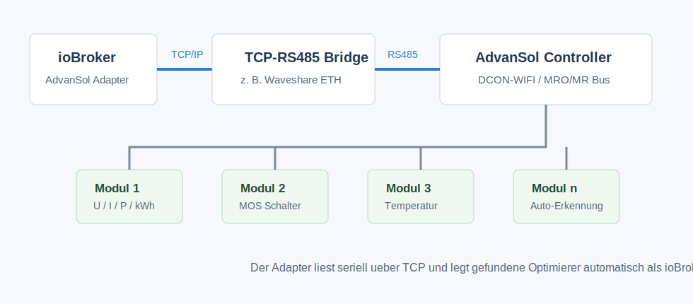
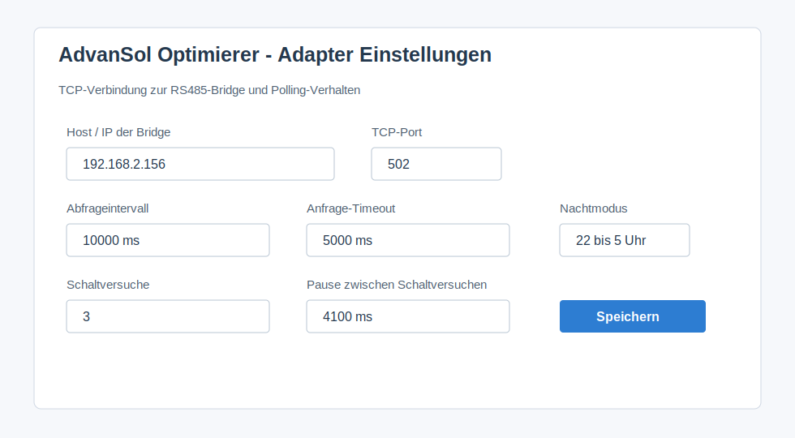
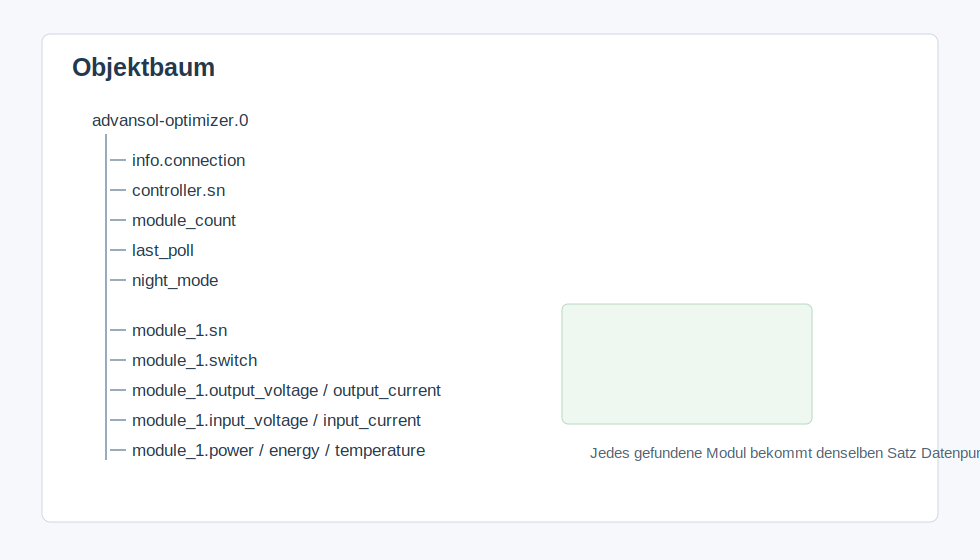

# ioBroker AdvanSol Optimizer Adapter

ioBroker adapter for AdvanSol DCON-WIFI / MRO/MR optimizers connected through a TCP-to-RS485 bridge, for example a Waveshare ETH-to-RS485 adapter.

The adapter is based on the original ioBroker JavaScript script `Advinsol Optimierer2` and moves the logic into a dedicated ioBroker adapter namespace.



## Features

- Connects to a TCP RS485 bridge.
- Reads the controller serial number.
- Discovers connected optimizer modules automatically.
- Polls module values cyclically.
- Switches each optimizer MOS through `module_X.switch`.
- Skips polling during a configurable night window.
- Exposes connection state and night mode states.

## Typical Setup

1. ioBroker runs in the local network.
2. A TCP-RS485 bridge is reachable via LAN or Wi-Fi.
3. The RS485 side of the bridge is connected to the AdvanSol controller.
4. The controller communicates with the optimizer modules.

Recommended bridge configuration:

- Mode: TCP server
- Port: same as configured in the adapter, default `502`
- Serial settings: matching the AdvanSol controller and RS485 bus
- RS485 A/B connected correctly
- Only one active master on the RS485 bus

## Adapter Settings



| Setting | Meaning | Default |
| --- | --- | --- |
| `Host` | IP address or host name of the TCP-RS485 bridge | empty |
| `TCP port` | TCP port of the bridge | `502` |
| `Polling interval` | Time between polling cycles in milliseconds | `10000` |
| `Request timeout` | Maximum wait time for a response | `5000` |
| `Switch retries` | Number of repeated MOS switch commands | `3` |
| `Switch retry delay` | Delay between switch attempts | `4100` |
| `Night mode starts` | Hour where polling is skipped | `22` |
| `Night mode ends` | Hour where polling resumes | `5` |

The night window avoids unnecessary errors when optimizers do not respond at night or without PV-side voltage.

## States



General states:

| State | Meaning |
| --- | --- |
| `info.connection` | Connection to the TCP-RS485 bridge |
| `connection` | Additional connection state |
| `controller.sn` | Controller serial number |
| `module_count` | Number of discovered optimizers |
| `last_poll` | Time of the last successful poll cycle |
| `night_mode` | Adapter detected night mode |

Each optimizer gets a channel named `module_1`, `module_2`, `module_3` and so on.

| State | Meaning | Unit |
| --- | --- | --- |
| `module_X.sn` | Optimizer serial number |  |
| `module_X.switch` | MOS on/off, writable |  |
| `module_X.mos` | MOS status, `0` off and `1` on |  |
| `module_X.software` | Software version |  |
| `module_X.hardware` | Hardware version |  |
| `module_X.output_voltage` | Output voltage | V |
| `module_X.output_current` | Output current | A |
| `module_X.input_voltage` | Input voltage | V |
| `module_X.input_current` | Input current | A |
| `module_X.power` | Power | W |
| `module_X.energy` | Total energy | kWh |
| `module_X.temperature` | Temperature | degC |
| `module_X.raw` | Raw response as hex string |  |
| `module_X.last_update` | Last module update |  |

## Switching Optimizers

The state `module_X.switch` is writable. Setting it to `true` sends the MOS-on command for the module serial number. Setting it to `false` sends the MOS-off command.

The adapter repeats the command according to `Switch retries` and waits `Switch retry delay` between attempts. This is intentional because TCP-RS485 converters and optimizer modules may not acknowledge every command immediately.

## Installation

From npm:

```bash
iobroker install iobroker.advansol-optimizer
```

From a local package:

```bash
iobroker url /path/to/iobroker.advansol-optimizer-0.1.6.tgz
```

From a project folder:

```bash
iobroker url /root/iobroker.advansol-optimizer
```

After installation, create an instance, enter the bridge host and port, and start the instance.

## Troubleshooting

- No connection: check IP address, port and TCP server mode of the bridge.
- `TCP connect timeout`: bridge is not reachable or the port is wrong.
- No modules discovered: check RS485 A/B, controller power and PV-side supply.
- No daytime responses: check RS485 parameters and wiring.
- No nighttime responses: usually normal if optimizers sleep without PV voltage. Adjust the night window.
- Switching does not work: serial number must be known, module must respond, increase `Switch retries` if needed.
- Multiple systems on the bus: make sure there is not more than one active master sending frames.

## Changelog

### 0.1.6

- Switched CI to the standard ioBroker testing actions.
- Added standard package and integration tests for the repository checker.
- Added ioBroker development tooling and release configuration.
- Enabled jsonConfig i18n files.

### 0.1.5

- Fixed remaining adapter checker findings for repository metadata, workflow configuration and admin configuration.

### 0.1.4

- Published through the automated GitHub Actions release workflow with npm provenance.

### 0.1.3

- Added GitHub Actions release workflow with npm provenance publishing.
- Added responsive admin configuration metadata.
- Added repository metadata required by the ioBroker adapter checker.
- Updated README content for English-only publication checks.

### 0.1.2

- Updated package metadata for ioBroker adapter checker compatibility.
- Added repository, testing, license information, tier and extended translations.

### 0.1.1

- Added adapter icon and localized admin configuration labels.

### 0.1.0

- Initial adapter version based on the existing ioBroker JavaScript optimizer script.

Older entries can be moved to [CHANGELOG_OLD.md](CHANGELOG_OLD.md) when the changelog grows.

## License

Copyright (c) 2026 TheBam1990

MIT License. See [LICENSE](LICENSE) for details.
